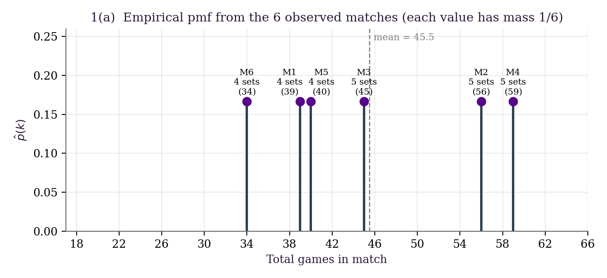
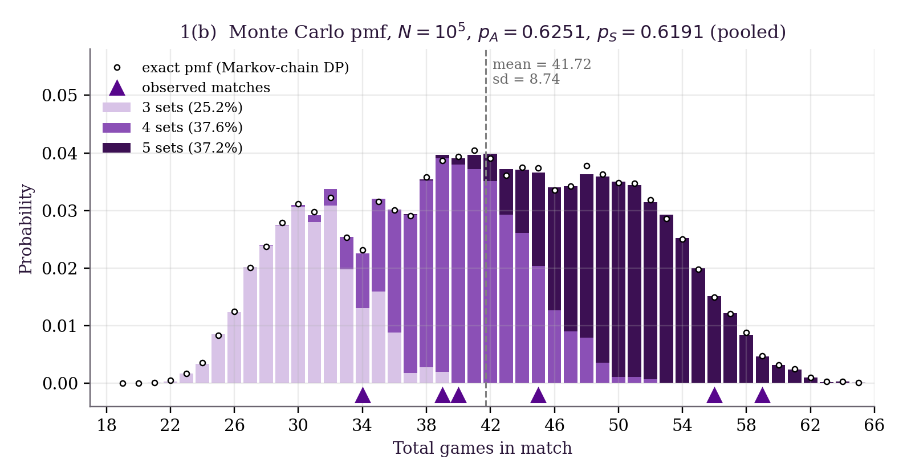
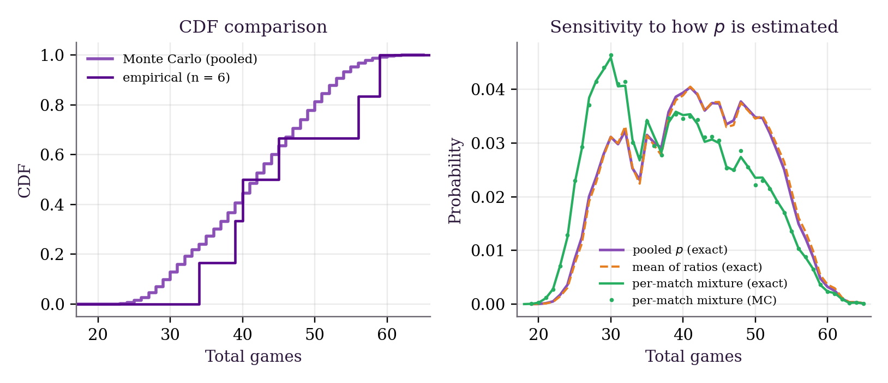
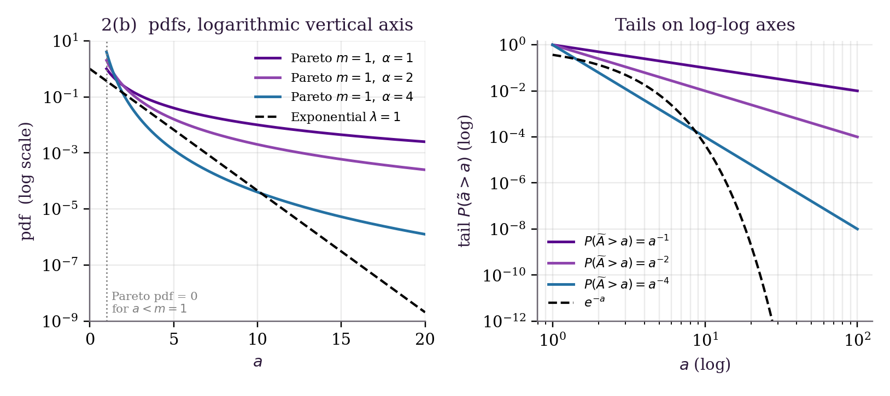
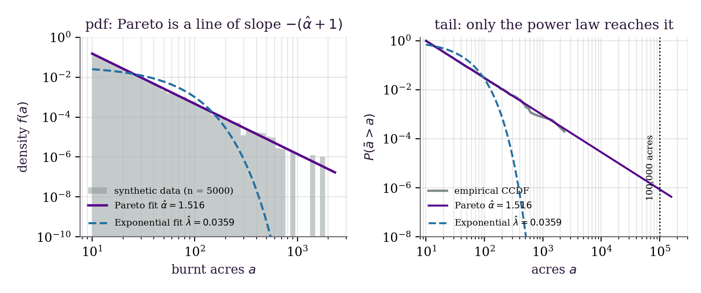
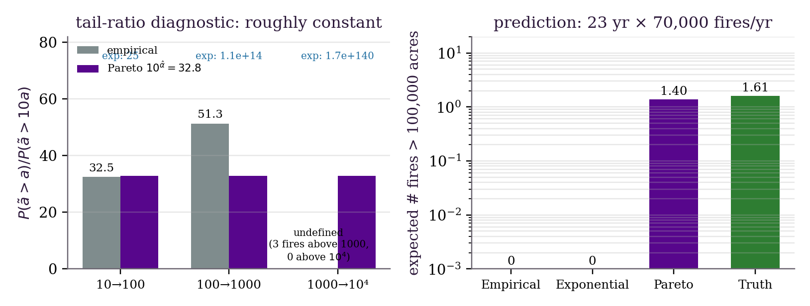
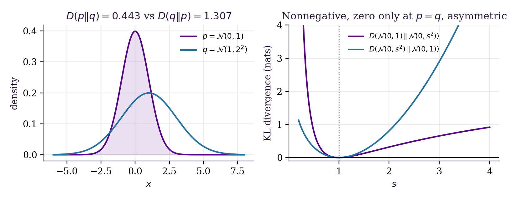
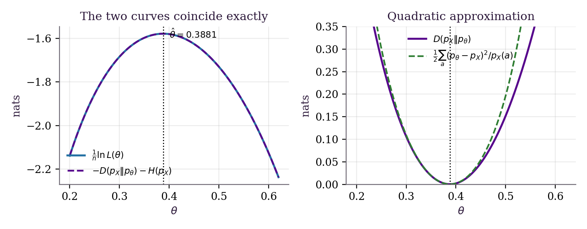
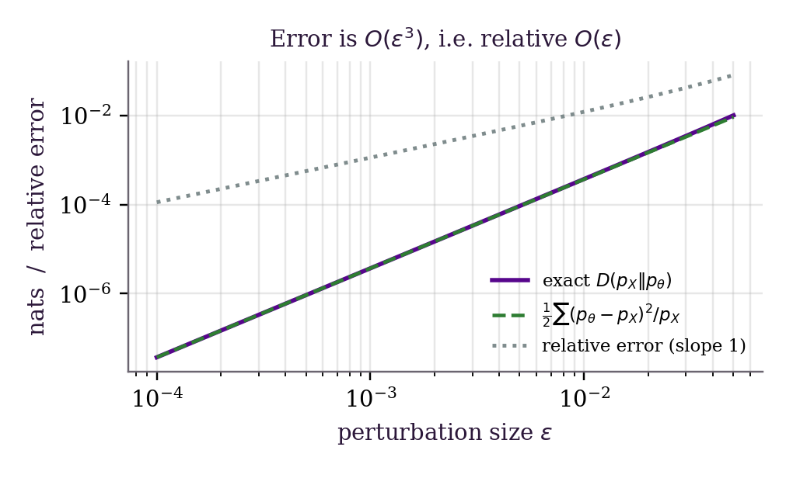

# Mathematical Probability — Complete Solutions

**Student:** Eliguli Han  
**Institution:** New York University  
**Topics:** probability mass functions, Pareto tails, maximum likelihood, and KL divergence

This document presents the mathematical argument behind each computation. All
reported numerical values are reproduced by the Python scripts in the
repository. Natural logarithms are used throughout, so KL divergence is
measured in nats.

## 1. Tennis probability mass functions

### 1(a). Empirical pmf

The total numbers of games in the six observed matches are

$$
39,\ 56,\ 45,\ 59,\ 40,\ 34.
$$

For a possible total \(k\), the empirical probability mass function is

$$
\widehat p(k)
=\frac{1}{6}\sum_{i=1}^{6}\mathbf 1\{k_i=k\}.
$$

All six observations are distinct. Therefore,

$$
\widehat p(k)=
\begin{cases}
1/6, & k\in\{34,39,40,45,56,59\},\\
0, & \text{otherwise}.
\end{cases}
$$

This is a valid empirical pmf but not a persuasive estimate of the population
distribution. With only six observations, probabilities can change only in
increments of \(1/6\), and the estimate assigns zero mass to many entirely
plausible match lengths. The sample mean is \(45.5\) games and the sample
standard deviation, using divisor six, is approximately \(9.1\) games.

### 1(b). Point-by-point Monte Carlo model

Pooling the service-point records gives

$$
p_A=\frac{532}{851}=0.6251,\qquad
p_S=\frac{564}{911}=0.6191.
$$

If a server independently wins each point with probability \(p\), write
\(q=1-p\). The probability of holding before deuce is

$$
p^4+4p^4q+10p^4q^2.
$$

The probability of reaching deuce is \(20p^3q^3\). From deuce, a two-point
cycle ends either with two server points or two returner points; otherwise the
score returns to deuce. Hence the conditional hold probability from deuce is

$$
\frac{p^2}{p^2+q^2}.
$$

Therefore,

$$
P(\text{hold}\mid p)
=p^4+4p^4q+10p^4q^2
+20p^3q^3\frac{p^2}{p^2+q^2}.
$$

This yields hold probabilities \(0.7857\) for Alcaraz and \(0.7741\) for
Sinner.

The simulation implements standard games, a first-to-seven tie-break with a
two-point margin, alternating service, and a best-of-five match. The initial
server is selected by a fair coin. With seed 42 and \(100{,}000\) simulated
matches, the estimated total-games distribution has:

| Statistic | Monte Carlo value |
|---|---:|
| Mean | 41.72156 |
| Standard deviation | 8.74 |
| Minimum observed | 21 |
| Maximum observed | 65 |
| Three sets | 25.188% |
| Four sets | 37.620% |
| Five sets | 37.192% |

This pmf is substantially more plausible than the six-point empirical pmf. It
is smooth over the feasible range and its components have a clear
interpretation: straight-set, four-set, and five-set matches overlap to produce
the visible peaks.

### Exact validation and sensitivity

The same model can be solved exactly. First compute each player's game-hold
probability. Then recursively propagate the state consisting of:

- the game score inside the current set;
- the identity of the current server;
- the set score;
- the cumulative number of games.

At \(6\)-all, a separate tie-break recursion uses the service order
A, BB, AA, BB, and so on. Absorbing states occur when either player wins three
sets. The resulting exact pmf sums to one and has mean

$$
\mathbb E[G]=41.734545.
$$

The total-variation distance between the exact and simulated pmfs is

$$
d_{\mathrm{TV}}
=\frac12\sum_g
\left|\widehat p_{\mathrm{MC}}(g)-p_{\mathrm{exact}}(g)\right|
=0.008045,
$$

which is consistent with ordinary Monte Carlo error. The exact probabilities
of a three-, four-, and five-set match are

$$
(0.251249,\ 0.374999,\ 0.373752).
$$

Using the mean of the six per-match service ratios changes the exact mean only
slightly, to \(41.96\) games. A mixture that randomly selects one observed
match's service rates before each simulated match has mean \(38.7\) and mode
30. The pooled model is the preferred baseline because single-match service
rates partly reflect how that match happened to unfold.

The model still has important limitations: it assumes point independence,
fixed service probabilities, and no surface, form, fatigue, momentum, or
pressure effects.

## 2. Pareto distribution

### 2(a). Exponential tail

For an exponential random variable with rate \(\lambda>0\),

$$
P(\widetilde A>a)
=\int_a^\infty \lambda e^{-\lambda t}\,dt
=e^{-\lambda a}.
$$

This tail decreases faster than any power because

$$
a^k e^{-\lambda a}\longrightarrow 0
\qquad\text{for every fixed }k>0.
$$

### 2(b). Pareto CDF and density

Suppose \(\widetilde A\ge m>0\) and its tail is proportional to
\(a^{-\alpha}\), where \(\alpha>0\). Writing

$$
P(\widetilde A>a)=Ca^{-\alpha},\qquad a\ge m,
$$

the boundary condition \(P(\widetilde A>m)=1\) gives \(C=m^\alpha\).
Thus,

$$
P(\widetilde A>a)=\left(\frac{m}{a}\right)^\alpha,
\qquad a\ge m,
$$

and

$$
F_{\widetilde A}(a)=
\begin{cases}
0, & a<m,\\
1-\left(\dfrac{m}{a}\right)^\alpha, & a\ge m.
\end{cases}
$$

Differentiation gives

$$
f_{\widetilde A}(a)=
\begin{cases}
\dfrac{\alpha m^\alpha}{a^{\alpha+1}}, & a\ge m,\\
0, & a<m.
\end{cases}
$$

The density is normalized since

$$
\int_m^\infty \alpha m^\alpha a^{-\alpha-1}\,da=1.
$$

For \(m=1\), smaller \(\alpha\) gives a heavier tail. The mean exists only when
\(\alpha>1\), in which case it is \(\alpha m/(\alpha-1)\). The variance exists
only when \(\alpha>2\).

### 2(c). Scale invariance

For \(s>1\) and \(a\ge m\),

$$
\frac{P(\widetilde A>a)}
     {P(\widetilde A>sa)}
=
\frac{(m/a)^\alpha}{(m/(sa))^\alpha}
=s^\alpha.
$$

The ratio is independent of \(a\). Multiplying the threshold by the same factor
always divides the tail probability by the same amount. This is the
scale-invariance property of a power law.

For an exponential tail, the corresponding ratio is

$$
\frac{e^{-\lambda a}}{e^{-\lambda sa}}
=e^{\lambda(s-1)a},
$$

which grows with \(a\) and is not scale invariant.

### 2(d). Pareto maximum-likelihood estimators

For independent observations \(x_1,\ldots,x_n\), the likelihood is

$$
L(m,\alpha)
=\alpha^n m^{n\alpha}
\prod_{i=1}^n x_i^{-\alpha-1}
\mathbf 1\{m\le x_{(1)}\},
\qquad
x_{(1)}=\min_i x_i.
$$

For fixed \(\alpha\), the likelihood increases in \(m\) over its feasible
range. Therefore, the scale estimate is the largest allowed value:

$$
\boxed{\widehat m=x_{(1)}=\min_i x_i.}
$$

Substituting \(\widehat m\), the log-likelihood as a function of \(\alpha\) is

$$
\ell(\alpha)
=n\log\alpha+n\alpha\log\widehat m
-(\alpha+1)\sum_{i=1}^n\log x_i.
$$

Its first derivative is

$$
\ell'(\alpha)
=\frac{n}{\alpha}
-\sum_{i=1}^n\log\left(\frac{x_i}{\widehat m}\right).
$$

Setting this equal to zero gives

$$
\boxed{
\widehat\alpha
=\frac{n}
{\sum_{i=1}^n\log(x_i/\widehat m)}.
}
$$

Since \(\ell''(\alpha)=-n/\alpha^2<0\), this stationary point is the unique
global maximizer.

## 3. Catastrophic fires

A catastrophic fire burns more than \(100{,}000\) acres. At \(70{,}000\)
fires per year for 23 years, the projected total number of fires is

$$
N_{\mathrm{total}}
=23(70{,}000)
=1{,}610{,}000.
$$

### 3(a). Empirical model

If the 1995 sample contains \(N_{1995}\) fires and
\(N_{\mathrm{cat},1995}\) catastrophic fires, then

$$
\widehat P(\widetilde A>100{,}000)
=\frac{N_{\mathrm{cat},1995}}{N_{1995}},
$$

so the predicted future count is

$$
1{,}610{,}000
\frac{N_{\mathrm{cat},1995}}{N_{1995}}.
$$

This estimate is unreliable because the event is rare, one year may not be
representative of the next 23 years, and an empirical distribution assigns zero
probability above its largest observation. It cannot extrapolate to a new
record-sized fire.

### 3(b). Exponential model

For the unshifted exponential model,

$$
\widehat\lambda=\frac{1}{\overline x},
\qquad
\widehat P(\widetilde A>100{,}000)
=e^{-100{,}000/\overline x}.
$$

When the mean fire size is measured in tens or hundreds of acres, the exponent
is extremely negative and the estimated probability is numerically zero. This
is a structural failure of a light-tailed model, not merely a lack of data.

### 3(c). Tail-ratio diagnostic

For thresholds \(a,10a,100a,\ldots\), define

$$
R(a)=\frac{P(\widetilde A>a)}{P(\widetilde A>10a)}.
$$

The competing predictions are

$$
R_{\mathrm{Exp}}(a)=e^{9\lambda a},
\qquad
R_{\mathrm{Pareto}}(a)=10^\alpha.
$$

Approximately constant empirical ratios indicate a Pareto-like power-law tail;
rapidly increasing ratios indicate an exponential tail.

### 3(d). Pareto fit and prediction

The deterministic synthetic demonstration uses \(n=5000\) observations from a
Pareto distribution with \(m=10\) and \(\alpha=1.5\). The fitted values are

$$
\widehat m=10.000078,\qquad
\widehat\alpha=1.515540,\qquad
\widehat\lambda=0.035874.
$$

The first two finite empirical tail ratios are \(32.5\) and \(51.3\), while the
Pareto model predicts the constant

$$
10^{\widehat\alpha}=32.8.
$$

The exponential ratios increase from about \(25\) to \(1.1\times10^{14}\) and
then \(1.7\times10^{140}\), contradicting the approximately stable empirical
behavior.

The fitted Pareto catastrophic-fire probability is

$$
\widehat P(\widetilde A>100{,}000)
=\left(\frac{\widehat m}{100{,}000}\right)^{\widehat\alpha}
=8.67\times10^{-7}.
$$

Thus, the expected number over 23 years is

$$
1{,}610{,}000(8.67\times10^{-7})=1.40.
$$

The generating Pareto model implies \(1.61\) such fires. Both the empirical and
exponential fits predict zero at this threshold.

The corrected code uses the same unshifted exponential model for estimation,
density plotting, survival probabilities, and prediction:

$$
f(a)=\widehat\lambda e^{-\widehat\lambda a},
\qquad
P(A>a)=e^{-\widehat\lambda a}.
$$

This consistency correction does not affect the substantive comparison: the
exponential tail still vanishes much too quickly.

## 4. Kullback–Leibler divergence

### Nonnegativity

For pmfs \(p\) and \(q\) on support \(\mathcal A\),

$$
D(p\Vert q)
=\sum_{a\in\mathcal A}
p(a)\log\frac{p(a)}{q(a)}.
$$

Apply Jensen's inequality to the concave function \(\log\):

$$
\begin{aligned}
-D(p\Vert q)
&=\sum_a p(a)\log\frac{q(a)}{p(a)}\\
&\le
\log\left(\sum_a p(a)\frac{q(a)}{p(a)}\right)\\
&=\log\left(\sum_a q(a)\right)
\le 0.
\end{aligned}
$$

Therefore,

$$
\boxed{D(p\Vert q)\ge0.}
$$

Strict concavity implies equality only when \(q(a)/p(a)\) is constant
\(p\)-almost surely. Normalization forces the constant to be one, so
\(D(p\Vert q)=0\) exactly when \(p=q\). If \(p(a)>0\) but \(q(a)=0\) for any
outcome, then \(D(p\Vert q)=+\infty\).

### KL divergence between multivariate Gaussians

Let

$$
p=\mathcal N(\mu_0,\Sigma_0),
\qquad
q=\mathcal N(\mu_1,\Sigma_1)
$$

on \(\mathbb R^d\). By definition,

$$
D(p\Vert q)=\mathbb E_p[\log p(X)-\log q(X)].
$$

The first quadratic expectation is

$$
\mathbb E_p[
(X-\mu_0)^\mathsf T\Sigma_0^{-1}(X-\mu_0)]
=\operatorname{tr}(\Sigma_0^{-1}\Sigma_0)
=d.
$$

Writing \(X-\mu_1=(X-\mu_0)+(\mu_0-\mu_1)\), the cross term vanishes and

$$
\begin{aligned}
&\mathbb E_p[
(X-\mu_1)^\mathsf T\Sigma_1^{-1}(X-\mu_1)]\\
&\qquad=
\operatorname{tr}(\Sigma_1^{-1}\Sigma_0)
+(\mu_0-\mu_1)^\mathsf T
\Sigma_1^{-1}(\mu_0-\mu_1).
\end{aligned}
$$

Substitution into the two Gaussian log densities gives

$$
\boxed{
D(p\Vert q)
=\frac12\left[
\log\frac{|\Sigma_1|}{|\Sigma_0|}
-d
+\operatorname{tr}(\Sigma_1^{-1}\Sigma_0)
+(\mu_1-\mu_0)^\mathsf T
\Sigma_1^{-1}(\mu_1-\mu_0)
\right].
}
$$

The Python implementation uses signed log determinants and linear solves rather
than explicit determinants and matrix inverses, which is numerically more
stable.

For the reproducible four-dimensional example,

$$
D(p\Vert q)=1.7566
$$

from the closed form, while the Monte Carlo estimate is

$$
1.7540\pm0.0058
$$

using three standard errors. The reverse divergence is \(1.4244\), confirming
that KL divergence is asymmetric.

### 4(a). Maximum likelihood is KL minimization

Let \(n_a\) be the count of outcome \(a\) and

$$
p_X(a)=\frac{n_a}{n}.
$$

The parametric likelihood can be grouped by outcomes:

$$
L(\theta)
=\prod_{i=1}^n p_\theta(x_i)
=\prod_{a\in\mathcal A}p_\theta(a)^{n_a}.
$$

Therefore,

$$
\frac1n\log L(\theta)
=\sum_a p_X(a)\log p_\theta(a).
$$

The empirical-to-model divergence is

$$
\begin{aligned}
D(p_X\Vert p_\theta)
&=\sum_a p_X(a)\log p_X(a)
-\sum_a p_X(a)\log p_\theta(a)\\
&=-H(p_X)-\frac1n\log L(\theta).
\end{aligned}
$$

Since the empirical entropy \(H(p_X)\) is constant in \(\theta\),

$$
\boxed{
\operatorname*{arg\,max}_\theta L(\theta)
=
\operatorname*{arg\,min}_\theta
D(p_X\Vert p_\theta).
}
$$

For the binomial demonstration with \(K=6\) and \(n=800\), the grid maximizer
of average log-likelihood and the grid minimizer of KL are both \(0.3883\).
The closed-form estimator is \(0.3881\). The identity

$$
\frac1n\log L+D+H=0
$$

holds over the numerical grid to \(6.7\times10^{-16}\).

### 4(b). Second-order approximation

Set

$$
u_a=\frac{p_\theta(a)}{p_X(a)}.
$$

When \(p_\theta\) is close to \(p_X\),

$$
\log u_a
=(u_a-1)-\frac12(u_a-1)^2
+O((u_a-1)^3).
$$

Because

$$
D(p_X\Vert p_\theta)
=-\sum_a p_X(a)\log u_a,
$$

the linear term vanishes:

$$
\sum_a p_X(a)(u_a-1)
=\sum_a[p_\theta(a)-p_X(a)]
=0.
$$

The second-order term gives

$$
\boxed{
D(p_X\Vert p_\theta)
\approx
\frac12\sum_{a\in\mathcal A}
\frac{[p_\theta(a)-p_X(a)]^2}{p_X(a)}.
}
$$

Thus, maximum likelihood is locally a weighted least-squares fit with weights
\(1/p_X(a)\). Rare empirical outcomes receive more weight.

In count notation, with \(O_a=np_X(a)\) and \(E_a=np_\theta(a)\),

$$
D(p_X\Vert p_\theta)
\approx
\frac{1}{2n}\sum_a\frac{(O_a-E_a)^2}{O_a}.
$$

The denominator is empirical, so this is Neyman's modified chi-square form.
Pearson's form uses \(E_a\) in the denominator. They differ at third order but
are asymptotically equivalent near the optimum.

The perturbation experiment confirms the expansion. At
\(\varepsilon=10^{-3}\), the relative approximation error is
\(1.06\times10^{-3}\), and the log–log slope of relative error against
\(\varepsilon\) is \(1.04\). Therefore, the relative error is
\(O(\varepsilon)\) and the absolute error is \(O(\varepsilon^3)\).

## Reproduction

Run the complete pipeline from the repository root:

    python3 -m pip install -r requirements.txt
    python3 run_all.py
    python3 verify_report.py

The first command installs the Python dependencies, the second regenerates all
figures, numerical summaries, the execution log, and the LaTeX PDF, and the
third checks 31 numerical claims in the PDF against the generated JSON files.
